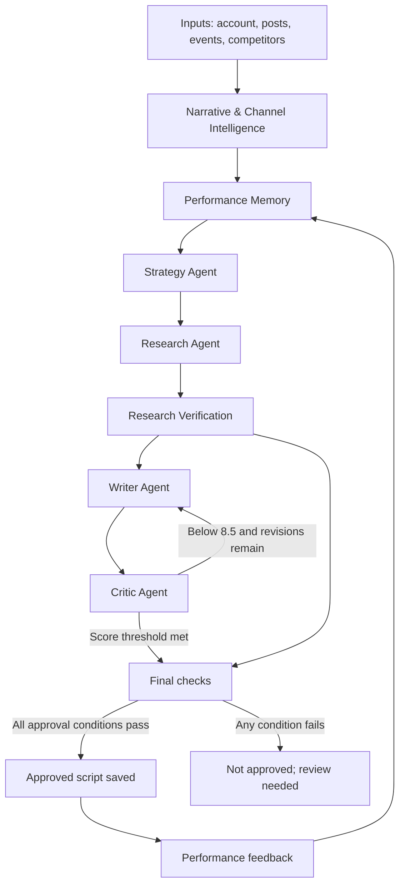

# NAZAR — Multi-Agent Instagram Growth Brain

> **A research-aware, memory-driven multi-agent prototype for Instagram Reel strategy, script generation, critique, and performance learning.**

**Core idea:** Facts. Context. Perspective.

NAZAR is a prototype designed to help a creator move from account context and content history to a researched, strategically aligned Hinglish Reel draft. Instead of asking one model to do everything in a single prompt, the project separates the work into focused stages such as intelligence, strategy, research, writing, critique, verification, and feedback memory.

This repository demonstrates an end-to-end workflow and its guardrails. It is **not** a live Instagram publishing system, and sample performance data must not be mistaken for actual account analytics.

---

## Contents

- [1. Project at a glance](#1-project-at-a-glance)
- [2. What problem does it solve?](#2-what-problem-does-it-solve)
- [3. Main capabilities](#3-main-capabilities)
- [4. How the system works](#4-how-the-system-works)
- [5. Agent and module responsibilities](#5-agent-and-module-responsibilities)
- [6. Important quality rules](#6-important-quality-rules)
- [7. Technology stack](#7-technology-stack)
- [8. Repository structure](#8-repository-structure)
- [9. Requirements](#9-requirements)
- [10. Setup on Windows, step by step](#10-setup-on-windows-step-by-step)
- [11. Configure environment variables](#11-configure-environment-variables)
- [12. Prepare and understand the sample data](#12-prepare-and-understand-the-sample-data)
- [13. Initialize and inspect the database](#13-initialize-and-inspect-the-database)
- [14. Run the intelligence and memory demos](#14-run-the-intelligence-and-memory-demos)
- [15. Launch the Streamlit application](#15-launch-the-streamlit-application)
- [16. Run the automated tests](#16-run-the-automated-tests)
- [17. Understand the workflow result](#17-understand-the-workflow-result)
- [18. Example performance-memory demonstration](#18-example-performance-memory-demonstration)
- [19. Guardrails and validation](#19-guardrails-and-validation)
- [20. Current status and known limitations](#20-current-status-and-known-limitations)
- [21. Reproduce a reviewer walkthrough](#21-reproduce-a-reviewer-walkthrough)
- [22. Troubleshooting](#22-troubleshooting)
- [23. Git and GitHub workflow](#23-git-and-github-workflow)
- [24. Suggested future improvements](#24-suggested-future-improvements)
- [25. Responsible use and publishing checklist](#25-responsible-use-and-publishing-checklist)

---

## 1. Project at a glance

| Item | Description |
|---|---|
| Project | NAZAR — Multi-Agent Instagram Growth Brain |
| Purpose | Assist with content intelligence, Reel strategy, research, scripting, critique, and learning |
| Output | A strategic direction and a structured Hinglish Reel draft; approval depends on configured checks |
| Interface | Streamlit |
| Workflow orchestration | LangGraph |
| Data validation | Pydantic |
| Persistence | SQLite |
| Tests | Pytest |
| Performance examples | Synthetic/simulated data unless explicitly marked otherwise |
| Publishing | Manual review and publishing; no live Instagram publishing is claimed |

### Important status note

The project test suite has been reported as passing **115 tests**, and the Streamlit interface has been run locally. A recent end-to-end example completed its workflow, but the best critic score was **7.0/10**, below the required **8.5/10** approval threshold. That run was therefore not approved and was not saved as an approved script. A completed workflow does not automatically mean its generated content passed every quality gate.

---

## 2. What problem does it solve?

Creators often need to perform several different tasks before publishing a Reel:

1. Understand what their audience has recently seen.
2. Identify topics that may be repetitive or missing.
3. Select a useful angle instead of simply following a trend.
4. Find facts and credible sources.
5. Turn research into a short, clear script.
6. Review the hook, pacing, originality, and channel fit.
7. Learn from previous content performance.

Doing all of this manually can be time-consuming. Asking a single language model to perform every step at once can also make it difficult to inspect why a topic was selected, where facts came from, or why a draft was accepted or rejected.

NAZAR separates these responsibilities into modules and agents. The intent is to make the process easier to inspect, test, and improve. The system supports the creator; it does not replace editorial judgment or source review.

---

## 3. Main capabilities

### Content and account intelligence

- Calculates descriptive performance measures from available sample post data.
- Summarizes topics and content buckets.
- Identifies possible content gaps against configured topic coverage.
- Screens recent topics for possible fatigue.
- Produces signals that can inform strategy.

These analytics are descriptive. They do not prove that a particular topic, hook, or format caused a performance change.

### Performance memory

- Stores approved scripts and feedback in SQLite.
- Retrieves recent content and performance patterns.
- Keeps simulated and real feedback separate.
- Calculates descriptive engagement and related performance indicators.
- Provides historical signals to the Strategy Agent.

### Strategy generation

The Strategy Agent can recommend:

- Topic
- Content bucket
- Hook style
- Reel format
- Tone
- Rationale
- Confidence
- Topics, formats, or approaches to avoid

It can use fatigue and breakout signals as inputs. These signals guide decisions; they are not guarantees of future reach.

### Research and verification

- Retrieves research claims and evidence.
- Associates claims with sources.
- Checks whether evidence supports, conflicts with, or is insufficient to verify a claim.
- Preserves uncertain statuses instead of treating every retrieved statement as confirmed.

Research quality depends on the sources retrieved and the verification output. Review all important facts and URLs before publication.

### Script writing and critique

- Generates a structured Hinglish Reel script.
- Targets approximately **18–23 words per voiceover segment**.
- Scores the draft on hook strength, emotional arc, pacing, originality, and strategic alignment.
- Can revise a draft for up to **three rounds** when it is below the configured score threshold.
- Selects the best available revision, but does not approve it merely because revisions were attempted.

### Feedback and learning

- Records feedback as simulated or real.
- Detects descriptive fatigue and breakout patterns where enough feedback exists.
- Makes these patterns available to later strategy runs.
- Does not treat simulated metrics as actual Instagram outcomes.

---

## 4. How the system works

The following is the intended high-level workflow. A run can stop without an approved script if a quality gate is not met.



### Read the diagram from left to right

1. **Inputs:** The system starts with account context and available post, event/trend, and competitor information. Sample datasets are illustrative.
2. **Intelligence:** The intelligence modules summarize recent content, performance, possible gaps, and fatigue signals.
3. **Performance memory:** Historical scripts and feedback are retrieved so the strategy can use prior learnings.
4. **Strategy:** The Strategy Agent chooses a topic and creative direction and explains its reasoning.
5. **Research:** The Research Agent gathers claims and source evidence relevant to the selected topic.
6. **Research verification:** Claims are assessed against the collected evidence. Uncertain claims remain marked for review.
7. **Writing:** The Writer Agent turns the strategy and research into a structured Hinglish draft.
8. **Critique:** The Critic Agent scores the draft. A below-threshold draft may return to the Writer for a limited number of revisions.
9. **Final checks:** Verification and configured approval conditions are evaluated.
10. **Save or reject:** Only a draft meeting the approval conditions is saved as approved. Otherwise, the run can complete with a not-approved result.
11. **Feedback loop:** Once feedback is recorded, it can inform future strategy runs.

**Diagram note:** This diagram represents the intended system flow, not a promise that every run ends with an approved script. The application should show the actual result and failed checks for each run.

---

## 5. Agent and module responsibilities

| Component | Responsibility | Expected contribution |
|---|---|---|
| Narrative / Channel Intelligence | Understands available account and content context | Content summaries, opportunities, and warnings |
| Performance Analytics | Calculates post-level and account-level descriptive metrics | Comparable performance signals |
| Content Gap Analysis | Compares recent topic coverage with configured opportunities | Potentially under-covered areas |
| Fatigue Analysis | Screens repeated topics and possible performance decline | Fatigue warnings, not causal conclusions |
| Performance Memory | Persists and retrieves scripts and feedback | Historical context for future decisions |
| Strategy Agent | Selects the next creative direction | Topic, bucket, hook, format, tone, rationale, confidence |
| Research Agent | Collects facts and supporting evidence | Claims with source information |
| Research Verification Agent | Assesses evidence for research claims | Supported, conflicting, or needs-verification status |
| Writer Agent | Creates the structured Hinglish Reel | Draft script segments |
| Critic Agent | Reviews creative and strategic quality | Scores, feedback, and revision guidance |
| Script Verification | Checks script claims against supported research facts | Claim-level script assessment |
| Numeric Validation | Checks numeric consistency against available verified facts | Numeric validation result |
| Content Workflow | Orchestrates the stages and approval logic | Run result, revision history, approval decision |
| Streamlit App | Provides an interactive local interface | Human-accessible workflow and results |

Some intelligence and analytics functionality is deterministic rather than LLM-generated. This makes the calculations easier to reproduce and test, while agent-generated outputs remain dependent on model and source quality.

---

## 6. Important quality rules

### Script segment length

Each voiceover segment targets approximately **18–23 words**. Treat this as a content constraint that should be checked in the output, not as a guarantee that every generated draft will satisfy it on the first attempt.

### Critic threshold and revisions

- Approval threshold: **8.5/10**.
- The Critic evaluates hook strength, emotional arc, pacing, originality, and strategic alignment.
- A below-threshold draft can be revised for a maximum of **three rounds**.
- If the best score remains below 8.5, the workflow should report that it was not approved.
- Do not manually describe a below-threshold result as approved.

### Evidence and fact checking

- Research verification and script verification are distinct.
- A script claim can be supported by the evidence assessed for that claim while other research claims remain uncertain.
- Numeric consistency checks are not a complete fact-checking system.
- Verify important claims, dates, figures, and source URLs manually before publication.

### Memory and learning

- Keep simulated feedback clearly labeled.
- Compare real and simulated feedback separately.
- Fatigue and breakout signals are descriptive; they are not proof of causation.
- Avoid copying competitor scripts. Use competitor information only as context for original strategy.

---

## 7. Technology stack

The project uses the following technologies in its current implementation:

- **Python** — primary programming language.
- **LangGraph** — multi-stage workflow orchestration.
- **LangChain / OpenAI integration** — model-backed agent workflows.
- **Pydantic** — structured output models and validation.
- **SQLite** — local persistent storage for account, post, script, and feedback data.
- **Streamlit** — local user interface.
- **Pandas** — tabular data handling where used.
- **Pytest** — automated tests.
- **Git and GitHub** — version control and repository hosting.

The exact installed package versions are defined by the repository dependency file. Refer to `requirements.txt` rather than assuming versions from this overview.

---

## 8. Repository structure

The structure below is a guide to the main project areas. The exact set of files may evolve as the repository is developed.

```text
instagram-growth-brain/
│
├── app/
│   └── app.py                       # Streamlit entry point
│
├── data/
│   ├── sample_account.json          # Illustrative account context
│   ├── sample_events.json           # Illustrative event/trend inputs
│   ├── sample_competitors.json      # Illustrative competitor context
│   └── instagram_growth.db          # Generated local SQLite DB (if created)
│
├── docs/
│   └── architecture.md              # Architecture and workflow explanation
│
├── examples/
│   ├── strategic_brief.md           # Example strategy output
│   ├── critic_revision_history.md   # Example critique and revisions
│   ├── generated_script_status.md   # Example script/approval status
│   └── feedback_learning_demo.md    # Example memory/feedback output
│
├── loom/
│   └── recording_script.md          # Suggested walkthrough narration
│
├── scripts/
│   ├── demo_memory.py               # Performance-memory demo
│   └── run_intelligence.py          # Intelligence demo
│
├── src/
│   ├── agents/                      # Strategy, research, writer, critic, verification
│   ├── analytics/                   # Performance, gaps, fatigue, intelligence
│   ├── graph/                       # LangGraph workflow
│   ├── memory/                      # SQLite and performance memory
│   └── models/                      # Pydantic data models
│
├── tests/                           # Automated tests
├── .env.example                     # Environment-variable template, if present
├── .gitignore                       # Excludes secrets and generated artifacts
├── requirements.txt                 # Python dependencies
└── README.md
```

If your local repository differs, use the actual files in your checked-out branch as the source of truth. In particular, do not commit generated databases, virtual environments, API keys, or private credentials.

---

## 9. Requirements

Before starting, install or have access to:

1. **Python** — use a version compatible with the project's dependency file.
2. **VS Code** or another code editor.
3. **Git** — for version control.
4. **GitHub account and repository** — to host the source code.
5. **Terminal** — the steps below use Windows PowerShell.
6. **API credentials** — only for agent features that call external model or research services. Use the variable names documented by the project's `.env.example` or configuration code.

The project was developed and tested in a Windows PowerShell environment using a local `.venv`.

---

## 10. Setup on Windows, step by step

### Step 1 — Open the project folder

Open VS Code, select **File → Open Folder**, and choose the repository folder, for example:

```text
C:\Users\<your-user>\Desktop\News\instagram-growth-brain
```

Open a new terminal in VS Code using **Terminal → New Terminal**. Confirm the prompt is inside the project root.

You can check the current directory with:

```powershell
Get-Location
```

### Step 2 — Check Python and Git

```powershell
python --version
git --version
```

Both commands should print installed versions. If PowerShell says a command is not recognized, install the missing tool and reopen the terminal.

### Step 3 — Create a virtual environment

A virtual environment keeps this project's Python packages separate from other projects.

```powershell
python -m venv .venv
```

This creates a `.venv` directory in the project root. You normally create it once per local checkout.

### Step 4 — Activate the virtual environment

```powershell
.\.venv\Scripts\Activate.ps1
```

When activation succeeds, the prompt usually begins with `(.venv)`.

If PowerShell blocks activation due to execution policy, you can use the current-session command below, if permitted by your machine's policy:

```powershell
Set-ExecutionPolicy -Scope Process -ExecutionPolicy Bypass
.\.venv\Scripts\Activate.ps1
```

This changes policy only for the current PowerShell process. On managed devices, follow your organization's security policy instead.

### Step 5 — Update pip

```powershell
python -m pip install --upgrade pip
```

### Step 6 — Install project dependencies

From the project root, run:

```powershell
pip install -r requirements.txt
```

Wait for the installation to finish. If it fails, read the first relevant error, confirm that the virtual environment is active, and check that your Python version is supported by the dependency versions in the repository.

### Step 7 — Configure environment variables

Follow [Section 11](#11-configure-environment-variables). Do not paste credentials into source code or commit them to GitHub.

### Step 8 — Run a quick import check

```powershell
python -c "import sys; print(sys.executable)"
```

The printed executable should point inside your project's `.venv` directory. This confirms that the terminal is using the project's virtual environment.

### Step 9 — Run tests

```powershell
python -m pytest -q
```

The reported project baseline is **115 passed**. Your result may differ if the code or dependencies have changed since that run. If tests fail, resolve those failures before treating the checkout as verified.

### Step 10 — Start the application

```powershell
python -m streamlit run app/app.py
```

Streamlit prints a local URL, typically:

```text
http://localhost:8501
```

Open that address in your browser. To stop the app, return to the terminal and press `Ctrl + C`.

---

## 11. Configure environment variables

Some agent features require credentials for model or research providers. The exact variable names depend on the code version in your repository.

1. Check whether the repository includes `.env.example`.
2. Open it and read the documented variable names.
3. Create a local `.env` file in the project root if the application is configured to load one.
4. Copy the required variable names from `.env.example` and add your own credential values locally.
5. Confirm `.env` is ignored by Git before committing.

Example format only (replace names with the ones required by your actual configuration):

```dotenv
PROVIDER_API_KEY=replace_with_your_local_key
```

Do **not** use the example variable name unless it matches the application code. Never share a real key in screenshots, Loom recordings, issue reports, README files, or Git commits. If a credential is exposed, revoke it with the provider and create a replacement.

An unauthenticated Hugging Face Hub warning may appear in some environments. It can affect rate limits or download speed; it is not, by itself, proof that the project's own tests or workflow failed. Check the actual command result and traceback rather than dismissing every warning.

---

## 12. Prepare and understand the sample data

The repository uses sample datasets to demonstrate the workflow without requiring a live Instagram account connection.

Typical sample-data categories include:

- **Account:** channel identity and content context.
- **Posts:** previous topics and illustrative performance fields.
- **Events/trends:** possible time-sensitive opportunities.
- **Competitors:** public-facing context used for comparison, not copying.

### Steps

1. Open the JSON files in `data/`.
2. Read the keys and values to understand the expected structure.
3. Check whether the sample data is labeled synthetic or illustrative.
4. If you edit a dataset, preserve the schema expected by the loading/seeding script.
5. Do not describe sample values as real account results.
6. For a time-sensitive event, independently confirm the event date and source before using it in a published Reel.

If a sample dataset is not present in your branch, use the data-generation or seeding script included in that branch and follow its instructions. Do not create a differently shaped JSON file by guessing the schema.

---

## 13. Initialize and inspect the database

NAZAR uses SQLite for local persistence. The database layer includes records for account/content context, approved scripts, and performance feedback. The local database may be created by a setup or demo script and is generally reproducible from sample data.

### Steps

1. From the repository root, activate `.venv`.
2. Inspect the available scripts and their help text, if supported:

   ```powershell
   Get-ChildItem .\scripts
   ```

3. Use the project's database initialization or seed command, if one is provided in your checkout.
4. If using the memory demo, run it as a module:

   ```powershell
   python -m scripts.demo_memory
   ```

5. Review the terminal output for inserted sample records, feedback summaries, and any warnings.
6. Treat all generated example feedback as simulated unless the record is explicitly marked real.

The generated database file may be ignored by Git so each developer can create it locally. Do not commit a local database containing private or real account information unless the assignment explicitly requires it and sharing is authorized.

---

## 14. Run the intelligence and memory demos

Run commands from the repository root while `.venv` is active.

### Intelligence demo

```powershell
python -m scripts.run_intelligence
```

This runs the deterministic intelligence analysis available in the repository. Depending on the current sample data, it may report performance summaries, topic coverage, possible content gaps, or fatigue signals.

### Memory demo

```powershell
python -m scripts.demo_memory
```

This demonstrates the performance-memory path using sample or synthetic feedback. It can show recent scripts, feedback patterns, and descriptive fatigue or breakout signals.

### Memory demo with strategy generation

```powershell
python -m scripts.demo_memory --generate-strategy
```

This option also invokes strategy generation using the memory signals, when configured credentials and dependencies are available.

### Why use `python -m`?

Run package scripts from the project root with module syntax. For example:

```powershell
python -m scripts.demo_memory
```

Direct execution such as `python scripts/demo_memory.py` has previously caused:

```text
ModuleNotFoundError: No module named 'src'
```

Module execution helps Python resolve the project packages consistently. If imports still fail, confirm the terminal is in the repository root and the virtual environment is active.

---

## 15. Launch the Streamlit application

### Start the app

```powershell
python -m streamlit run app/app.py
```

### Use the interface

The exact controls may vary with the current UI version. In general:

1. Open the local Streamlit URL printed in the terminal.
2. Review or select the available account/sample context.
3. Enter or select a topic or run the available intelligence/strategy workflow.
4. Start the workflow using the interface control provided.
5. Review the strategy recommendation and its rationale.
6. Inspect research claims, source evidence, and verification statuses.
7. Review the generated script and its segment structure.
8. Inspect critic scores and revision history.
9. Check the final approval status and any failed checks.
10. Record performance feedback only when the relevant workflow is available, and label simulated values correctly.

A workflow that reaches the end can still return a **not approved** result. This is expected when the script does not satisfy the configured quality threshold or verification conditions.

### Stop the app

Click the terminal running Streamlit and press:

```text
Ctrl + C
```

---

## 16. Run the automated tests

### Run the full suite

```powershell
python -m pytest -q
```

The latest reported baseline for this project was:

```text
115 passed
```

The exact duration and result will depend on your checkout and environment.

### Run a focused test file

If you want to investigate a specific module, run its test file, for example:

```powershell
python -m pytest tests/test_content_workflow.py -q
```

Or run a test module relevant to performance analytics:

```powershell
python -m pytest tests/test_performance.py -q
```

Use the actual test filenames in your `tests/` directory if they differ.

### What do the tests establish?

Tests can establish that the tested code behaves as expected for the cases represented in the test suite. They do not prove that every model-generated fact is true, that a Reel will perform well, or that live Instagram integration works.

Before submission, rerun the full suite after the final code and documentation changes.

---

## 17. Understand the workflow result

A workflow run can produce useful outputs without approving the draft.

### Example observed run

In a recent run about India's foreign exchange reserves:

- The Strategy Agent selected an Economy-oriented direction.
- The Research Agent returned multiple claims and evidence.
- The Research Verification Agent marked some claims as needing verification, so the overall research set was not fully verified.
- The Script Verification Agent marked the specific script claims it assessed as supported.
- Numeric validation passed for the checked number.
- The Critic's best score was **7.0/10** after revisions.
- The required threshold was **8.5/10**.
- The final result was not approved, and the script was not saved as approved.

### How to interpret this

- **Research status** refers to the full set of research claims.
- **Script verification status** refers to the claims assessed in the generated script.
- **Numeric validation** checks numeric consistency against available verified facts; it is not a complete fact-check.
- **Critic score** measures the configured creative/strategic dimensions; it is not an objective prediction of reach.
- **Approval status** is the final gate. A draft below threshold should remain unapproved.

This distinction is important when presenting the prototype to reviewers: show both successful checks and the cases where the system correctly blocks approval.

---

## 18. Example performance-memory demonstration

The memory demo uses synthetic feedback to show how performance signals can be stored and retrieved.

A previous demonstration used four illustrative content examples. The output showed a simulated breakout signal for a topic with approximately **35% engagement**, compared with a **15.8%** baseline (about **2.22×** the baseline). The Strategy Agent then used that signal as contextual guidance while suggesting a different topic.

These figures are examples from synthetic data, not actual NAZAR account analytics and not evidence that the suggested topic will achieve similar results.

### What to show a reviewer

1. Run `python -m scripts.demo_memory`.
2. Point out that feedback records are marked simulated.
3. Show the difference between recent content and aggregate patterns.
4. Explain that fatigue and breakout are descriptive indicators.
5. Run `python -m scripts.demo_memory --generate-strategy`, if configured.
6. Show how memory can inform a fresh strategy without copying an old script or repeating its exact topic.

---

## 19. Guardrails and validation

The prototype includes several safeguards intended to reduce avoidable content and workflow errors.

| Guardrail | Purpose | Important caveat |
|---|---|---|
| Structured Pydantic models | Keep agent outputs in expected schemas | Valid structure does not guarantee factual correctness |
| Research evidence and URLs | Make source support inspectable | Sources still require quality review |
| Research verification statuses | Preserve uncertainty and conflicts | Model-based assessment can make mistakes |
| Script verification | Compare script claims against supported research | Only assessed claims are covered |
| Numeric validation | Catch mismatched numeric details | Not a full fact-checker |
| 18–23 word segment target | Encourage concise Reel voiceover | Generated output may still need editing |
| Critic threshold of 8.5/10 | Prevent low-scoring drafts from being approved | Score is a model judgment, not a performance guarantee |
| Maximum three revision rounds | Bound the revision loop | A draft may remain below threshold |
| Save only approved scripts | Avoid storing rejected drafts as approved | Confirm the final approval state in the UI/log |
| Fatigue screening | Flag repeated or declining topics | Descriptive, not causal |
| Simulated/real feedback separation | Avoid confusing demo metrics with real data | Correct labeling must be maintained |
| Competitor context | Inform original content strategy | Do not copy competitor content |

At least two guardrails should be demonstrated through tests during review. Refer to the actual tests in `tests/` and explain what each asserts rather than relying only on this summary.

---

## 20. Current status and known limitations

### Implemented and exercised

- Python project foundation, dependencies, and configuration.
- Synthetic sample datasets and SQLite persistence.
- Deterministic performance analytics, topic summaries, content-gap analysis, and fatigue screening.
- Performance memory and feedback records, with simulated and real feedback separated.
- Strategy generation informed by content history and memory signals.
- Research, research verification, structured script writing, critic scoring, and bounded revision workflow.
- Script verification and numeric consistency checks.
- Streamlit interface and end-to-end workflow execution.
- Automated tests; latest reported result was 115 passing.

### Known limitations

- **No live Instagram analytics connection is claimed.** Sample data and simulated feedback are used for demonstration.
- **No automatic Instagram publishing is claimed.** Human review remains necessary.
- **Research is not infallible.** A retrieved URL may be low quality, and a model can incorrectly assess support. Review facts and sources manually.
- **Not every run is approved.** A recent run remained below the 8.5/10 critic threshold after the allowed revisions.
- **Numeric validation is limited.** It checks number consistency, not every factual, causal, or contextual claim.
- **Performance patterns are descriptive.** Small or synthetic samples cannot establish causation or statistical significance.
- **Semantic similarity and fatigue thresholds need further real-data evaluation.** Thresholds should not be treated as universally validated.
- **Human editorial review is required.** Confirm accuracy, sensitivity, originality, language quality, and relevance before publishing.

### Recommended next improvements

Prioritize better source quality, robust verification of time-sensitive facts, a larger real-topic evaluation set for semantic duplicate detection, and authorized real analytics feedback if access becomes available.

---

## 21. Reproduce a reviewer walkthrough

This sequence is designed to help an interviewer or reviewer understand the system without reading every source file first.

### Walkthrough A — Verify the project

1. Clone the repository or open the submitted project folder.
2. Follow [Section 10](#10-setup-on-windows-step-by-step).
3. Run:

   ```powershell
   python -m pytest -q
   ```

4. Show the test summary.
5. Explain that passing tests validate implemented test cases, not real-world content performance.

### Walkthrough B — Explore intelligence and memory

1. Run:

   ```powershell
   python -m scripts.run_intelligence
   ```

2. Explain the descriptive performance metrics and possible content gaps.
3. Run:

   ```powershell
   python -m scripts.demo_memory
   ```

4. Show the simulated feedback labels and memory patterns.
5. Explain why a breakout signal is a prompt for further exploration, not a guaranteed winning formula.

### Walkthrough C — Generate a strategy

1. Ensure the local environment is configured.
2. Run the Streamlit application:

   ```powershell
   python -m streamlit run app/app.py
   ```

3. Open the local URL.
4. Start a strategy or workflow run using the available UI controls.
5. Explain the chosen topic, bucket, hook, format, tone, rationale, and confidence.
6. Point out any fatigue or breakout context used by the Strategy Agent.

### Walkthrough D — Inspect research and the script

1. Show the research claims and evidence.
2. Identify claims marked supported, conflicting, or needing verification.
3. Show the generated Hinglish script and segment word counts.
4. Explain the difference between research-level verification and script-level verification.
5. Show numeric validation output, if present.

### Walkthrough E — Explain critique and approval

1. Show the critic's five dimensions and total score.
2. Show the revision history and maximum revision limit.
3. If the best score is below 8.5, explain that the draft is not approved.
4. Show that the workflow does not save the rejected draft as an approved script.
5. Emphasize that this is an intentional quality gate, not a claim that the system always produces publish-ready scripts.

### Walkthrough F — Close with limitations

Explain clearly that the demo uses synthetic data, does not prove performance uplift, and still requires human fact-checking and editorial approval. Mention live Instagram integration only as future work unless it has been separately implemented and tested.

---

## 22. Troubleshooting

### `ModuleNotFoundError: No module named 'src'`

This can happen when a package script is executed directly.

**Try this from the repository root:**

```powershell
python -m scripts.demo_memory
```

or:

```powershell
python -m scripts.run_intelligence
```

If it still fails:

1. Run `Get-Location` and confirm you are in the project root.
2. Confirm `(.venv)` appears in the prompt.
3. Confirm the `src` directory exists in this checkout.
4. Run the command with `python -m`, not direct file execution.

As a temporary PowerShell alternative for the current terminal:

```powershell
$env:PYTHONPATH = (Get-Location).Path
python -m scripts.run_intelligence
```

### `python` or `pip` command is not recognized

1. Check that Python is installed.
2. Reopen PowerShell after installation.
3. Run `python --version`.
4. Prefer `python -m pip install -r requirements.txt` if the `pip` command alone is not resolved.

### Dependency installation fails

1. Confirm `.venv` is activated.
2. Upgrade pip with `python -m pip install --upgrade pip`.
3. Check the Python version required by the project dependencies.
4. Read the first package-specific error and resolve that cause.
5. Retry `pip install -r requirements.txt`.

### API key or authentication error

1. Confirm the expected environment-variable names from `.env.example` or the configuration code.
2. Confirm the local `.env` file is in the expected location and is loaded by the application.
3. Check that the credential is active and has the necessary provider permissions.
4. Never paste the secret into the terminal output shared with others, screenshots, or GitHub.

### Research or verification output is malformed, empty, or truncated

1. Read the stage-specific error shown in the terminal or UI.
2. Confirm model/provider configuration and network access.
3. Retry once if the failure appears transient.
4. Review the claim count and response size if the issue recurs.
5. Do not bypass verification or mark uncertain facts as supported just to force approval.

### Streamlit does not open

1. Confirm the terminal reports that Streamlit is running.
2. Open the local URL printed by the command.
3. Check whether port 8501 is already in use.
4. Stop an old Streamlit process with `Ctrl + C`, then restart.
5. Review the terminal traceback if the app exits.

### Workflow completes but no script is approved

This can be expected. Review the research statuses, script checks, critic score, and approval threshold. A run below 8.5/10 or with failed approval conditions should remain unapproved.

---

## 23. Git and GitHub workflow

### Check repository state

```powershell
git status
```

### Stage changes

```powershell
git add README.md docs data examples loom
```

Stage source and test changes too if they are part of your update:

```powershell
git add src tests app scripts
```

Do not stage `.env`, `.venv`, API keys, private account exports, or generated files that should remain local.

### Commit changes

```powershell
git commit -m "docs: improve project documentation"
```

### Push to GitHub

```powershell
git push
```

If your branch has not been connected to a remote yet, inspect:

```powershell
git remote -v
git branch
```

Use the repository's configured remote and branch. Do not paste access tokens into commands or commit them to the repository.

### Verify the push

Refresh the GitHub repository page and confirm the README renders correctly, the expected folders are present, and no secret or unintended local data was committed.

---

## 24. Suggested future improvements

1. **Real analytics integration:** Add an authorized Instagram data connection and validate imported metrics.
2. **Research quality:** Prefer primary and reputable sources, capture publication dates, and improve claim-to-source traceability.
3. **Verification robustness:** Evaluate verification decisions against a manually labeled set of claims.
4. **Semantic duplicate evaluation:** Validate similarity thresholds on a representative NAZAR topic history before relying on them.
5. **Performance evaluation:** Compare strategy choices with actual outcomes over a larger sample; avoid attributing causation from simple averages.
6. **Editorial controls:** Add a clear human approval step for sensitive, uncertain, or high-impact content.
7. **Observability:** Store stage-level outcomes and concise error details to make failed runs easier to debug.
8. **Documentation and demo:** Keep screenshots, examples, architecture, and walkthrough aligned with the latest repository behavior.

These are future improvements, not claims that the capabilities are already complete.

---

## 25. Responsible use and publishing checklist

Before publishing a generated Reel:

- [ ] Verify every important fact, date, number, and quotation against a reliable source.
- [ ] Open the source URLs and confirm that they support the specific claims.
- [ ] Recheck time-sensitive information close to publication.
- [ ] Review the script for clarity, natural Hinglish, tone, and audience suitability.
- [ ] Check segment word counts and edit awkward phrasing.
- [ ] Review critic feedback, but do not treat a high score as proof of accuracy or likely reach.
- [ ] Confirm the final approval state and resolve any failed checks.
- [ ] Avoid copying competitor content or presenting synthetic metrics as real.
- [ ] Apply human editorial judgment before posting.

**Final note:** NAZAR is a decision-support and content-development prototype. Its strongest demonstration is the inspectable workflow—how it uses context, evidence, memory, critique, and approval rules—not a promise of viral reach or guaranteed growth.
