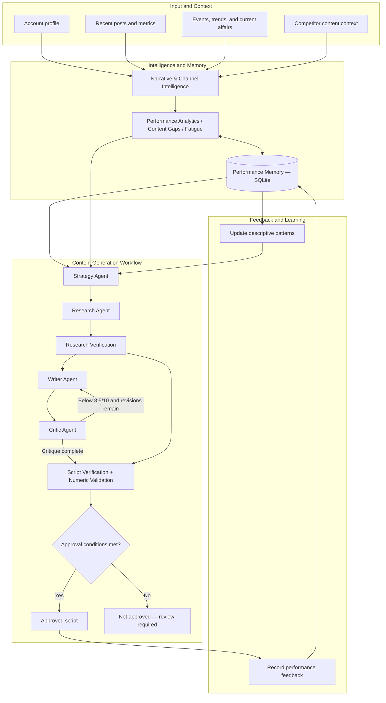
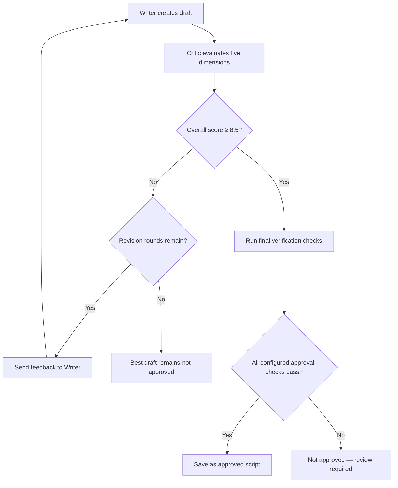

# NAZAR — Multi-Agent Instagram Growth Brain
## System Architecture and Workflow

**Purpose:** This document explains how the NAZAR prototype turns account context, content history, research, and performance feedback into a strategically selected and quality-checked Hinglish Instagram Reel draft.

> **Important:** This is the intended architecture of the prototype. A workflow can complete without approving a script. Only outputs that meet the configured approval conditions should be saved as approved scripts. Synthetic demonstration metrics are not actual Instagram analytics.

---

## 1. Architecture at a glance

NAZAR uses a staged, multi-agent workflow. Each agent or module has a focused responsibility, and structured data is passed between stages. Shared SQLite memory stores content and feedback that can inform later decisions.



### How to read the architecture

1. **Input and context:** The workflow receives available account information, recent posts and metrics, events or trends, and competitor context. These may be sample records rather than live platform data.
2. **Intelligence:** The intelligence modules summarize content and performance, identify possible gaps, and flag repeated or potentially fatigued topics.
3. **Performance memory:** SQLite stores and retrieves approved scripts and feedback. The strategy stage can use those historical signals.
4. **Strategy:** The Strategy Agent selects a topic and creative direction, explains its rationale, and provides a confidence estimate.
5. **Research:** The Research Agent gathers relevant claims and supporting evidence for the selected topic.
6. **Research verification:** The verification stage assesses the evidence for each research claim. Unsupported, conflicting, or uncertain claims should remain visible for review.
7. **Writing:** The Writer Agent creates a structured Hinglish Reel draft, targeting approximately 18–23 words per voiceover segment.
8. **Critique and revision:** The Critic Agent evaluates the script. If the score is below 8.5/10 and revision rounds remain, the draft can return to the Writer Agent.
9. **Final checks:** Script-level verification and numeric validation are applied alongside the configured workflow approval conditions.
10. **Decision:** A script that satisfies all approval conditions can be saved as approved. Otherwise, it remains not approved and requires review or further work.
11. **Feedback loop:** Feedback can be recorded for later learning. Simulated and real feedback must remain clearly separated.

The flowchart describes the logical pipeline. The exact ordering of internal checks and displayed stages is governed by the implementation in `src/graph/content_workflow.py`.

---

## 2. System layers

### 2.1 Input and context layer

This layer provides the information that downstream agents need.

| Input | Example fields | Why it matters |
|---|---|---|
| Account profile | Account identity, niche, audience, tone | Keeps recommendations aligned with the channel |
| Recent posts | Topic, content bucket, format, hook, publish date | Helps identify repetition and content coverage |
| Performance metrics | Views, reach, likes, shares, saves, comments, watch time, followers gained | Supports descriptive performance analysis |
| Events and trends | Event name, date, topic, source or reference | Helps identify timely opportunities |
| Competitor context | Public topic, format, hook approach, observed content gap | Provides market context without copying |

**Data caution:** A sample or manually entered value is not live Instagram data. Event recommendations should be checked for current accuracy and date relevance before publication.

### 2.2 Intelligence layer

The intelligence layer prepares a useful summary of available account context. Depending on the input data and implemented modules, it can include:

- Recent topic and content-bucket summaries
- Descriptive performance comparisons
- Possible content gaps
- Repeated topics and possible fatigue
- Audience or channel-alignment signals
- Trend and event context when available

Some analysis is deterministic code rather than an LLM agent. This helps make calculations reproducible and testable.

### 2.3 Shared memory layer

The shared memory layer is implemented using SQLite. It supports persistence between local runs and provides information to later workflows.

The database module includes tables for records such as:

- Accounts
- Posts
- Events
- Competitors and competitor posts
- Approved scripts
- Performance feedback

The exact schema is defined in `src/memory/database.py`. Memory is not a guarantee that every agent has access to every record in every run; each module retrieves the information it is designed to use.

### 2.4 Content-generation layer

The content-generation layer is the main orchestrated workflow:

**Strategy → Research → Research Verification → Writing → Critique and Revision → Final Checks → Approval Decision**

The workflow is coordinated in `src/graph/content_workflow.py`. Structured models in `src/models/` define the expected shape of key inputs and outputs.

### 2.5 User-interface layer

The Streamlit interface in `app/app.py` provides a local way to interact with the prototype and inspect workflow results. The UI is a review and demonstration interface; it should not be described as a live Instagram publishing interface unless such integration is separately implemented and tested.

---

## 3. Agent and module responsibilities

### 3.1 Narrative and Channel Intelligence

**Goal:** Understand the channel's current content context and surface useful signals for planning.

Typical responsibilities:

- Review account profile and recent posts available to the system.
- Summarize content buckets and topics.
- Identify potential content opportunities and gaps.
- Surface repeated topics or possible audience fatigue.
- Incorporate available event and trend context.

**Output:** A structured or summarized intelligence view used by the analytics and strategy stages.

**Limitations:** The quality of this stage depends on the completeness and recency of the provided account and content data. It cannot infer actual audience sentiment from missing data.

### 3.2 Performance Analytics

**Goal:** Calculate descriptive performance signals from available posts and feedback.

Possible measures include engagement-related rates, shares, saves, watch-time indicators, and comparisons across content. The exact calculations are implemented in the analytics modules.

**Output:** Descriptive metrics and patterns for strategy and review.

**Limitations:** Metrics are sensitive to sample size, missing fields, and inconsistent measurement windows. Correlation or a high observed metric does not prove that a hook, topic, or format caused the result.

### 3.3 Fatigue Analysis

**Goal:** Flag topics that may be overused or may be showing a decline in the available history.

The project includes post-history and feedback-backed fatigue analysis. Feedback-backed analysis distinguishes simulated and real feedback.

**Output:** Candidate fatigue warnings that the Strategy Agent can consider.

**Limitations:** Fatigue is a heuristic signal. Repetition or a decline in a small sample does not prove audience fatigue. A warning should prompt editorial consideration rather than automatically ban a topic.

### 3.4 Performance Memory

**Goal:** Persist approved scripts and performance feedback and retrieve historical patterns.

Key responsibilities include:

- Save approved script records.
- Record feedback with a simulated/real label.
- Retrieve recent content for an account.
- Calculate performance patterns from feedback.
- Keep simulated and real performance views separate.

**Output:** Historical context for strategy and learning.

**Limitations:** Memory only reflects records that have been stored. Synthetic records are useful for demonstrating system behavior but cannot be presented as actual account performance.

### 3.5 Strategy Agent

**Goal:** Choose a relevant content direction using intelligence, memory, and channel context.

The strategy output can include:

- Topic
- Content bucket
- Hook style
- Format
- Tone
- Rationale
- Confidence
- Topics, formats, or approaches to avoid

The Strategy Agent can consider fatigue and breakout signals as descriptive inputs. It should use those signals to explore fresh angles, not to copy prior scripts or guarantee similar results.

**Output:** A structured strategy recommendation for the research and writing stages.

**Limitations:** The recommendation is a model-assisted decision. Confidence is not a calibrated probability of reach, virality, or factual accuracy.

### 3.6 Research Agent

**Goal:** Gather facts, figures, context, and source evidence for the selected topic.

The research output is represented through structured models. Claims should be connected to supporting evidence and source references wherever available.

**Output:** Research claims, evidence, source URLs, and notes for verification.

**Limitations:** Retrieval may return incomplete, outdated, low-quality, or irrelevant material. A URL's presence does not prove that it supports the associated claim.

### 3.7 Research Verification Agent

**Goal:** Assess whether collected evidence supports the research claims.

Verification statuses used by the project include:

- **Supported:** Available evidence supports the claim as assessed.
- **Conflicting:** Available evidence conflicts with the claim.
- **Needs verification:** Evidence is insufficient, ambiguous, or requires further review.

**Output:** Claim-level verification assessments and an overall research status.

**Limitations:** This is a model-assisted evidence assessment, not an authoritative fact-checking service. Important claims should be reviewed against the original source.

### 3.8 Writer Agent

**Goal:** Turn the approved strategic direction and available research into a structured Hinglish Reel script.

The writer is expected to:

- Follow the chosen topic, content bucket, hook style, format, and tone.
- Use accessible language suitable for NAZAR's audience.
- Create a clear progression from hook to explanation and payoff.
- Keep each voiceover segment around 18–23 words.
- Avoid adding unsupported figures or claims.

**Output:** A structured script with voiceover segments and any supported scene or visual guidance included by the current model.

**Limitations:** A generated draft may still contain awkward phrasing, unsupported implications, or segment-length issues. Human editing remains necessary.

### 3.9 Critic Agent

**Goal:** Evaluate the draft and provide actionable revision feedback.

The critic assesses five dimensions:

1. Hook strength
2. Emotional arc
3. Pacing
4. Originality
5. Strategic alignment

The workflow uses an approval threshold of **8.5/10** and allows a maximum of **three revision rounds**.

**Output:** Scores, an overall score, critique notes, and suggestions for improvement.

**Limitations:** Critic scores are model judgments. A high score does not prove factual accuracy or predict engagement. If the best available score remains below the threshold, the workflow should not mark the script approved.

### 3.10 Script Verification and Numeric Validation

**Goal:** Apply final evidence-related checks to the script.

- Script verification compares script claims with supported research facts.
- Numeric validation checks numeric consistency against available verified facts.

**Output:** Claim assessments and numeric validation status used by the workflow's final decision.

**Limitations:** These checks cover the claims and numeric details they can identify and compare. They do not establish that every sentence is true, complete, non-misleading, or properly contextualized.

### 3.11 Content Workflow

**Goal:** Orchestrate the agents and apply the workflow's quality gates.

The workflow coordinates the stages, carries structured state, manages critique and revision, applies final checks, and decides whether a script can be saved as approved.

**Output:** A completed workflow result that may be approved or not approved, with research status, script checks, critic scores, and revision information as available.

**Key rule:** Workflow completion and script approval are different outcomes.

---

## 4. Data flow

The following table summarizes the main information passed through the workflow.

| Stage | Receives | Produces | Used by |
|---|---|---|---|
| Intelligence | Account, posts, event/trend, competitor context | Content and performance signals | Strategy |
| Performance Memory | Account identifier and stored records | Recent scripts and feedback patterns | Strategy and analytics |
| Strategy | Intelligence, memory, channel requirements | Topic and creative direction with rationale/confidence | Research and Writer |
| Research | Selected topic and context | Claims, evidence, source references | Research Verification and Writer |
| Research Verification | Research claims and evidence | Claim statuses and verification notes | Writer and final checks |
| Writer | Strategy and research context | Structured Hinglish script | Critic and script checks |
| Critic | Script and strategy requirements | Scores and revision feedback | Writer or final decision |
| Script Verification | Script claims and supported research | Script claim assessments | Final decision |
| Numeric Validation | Script numbers and verified facts | Numeric consistency result | Final decision |
| Approval Logic | Critic result, verification and configured checks | Approved or not approved status | Storage and UI |
| Feedback Memory | Script reference and performance metrics | Persisted feedback and patterns | Future strategy |

The implementation may store intermediate state in the workflow rather than persisting every intermediate object in SQLite. The database is primarily the persistent memory layer.

---

## 5. Approval and revision logic

The intended approval logic is quality-gated:



### Key rules

- The configured critic threshold is **8.5/10**.
- A below-threshold draft can be revised up to **three rounds**.
- The workflow can retain the best-scoring candidate for reporting.
- The best-scoring candidate is not automatically approved if it remains below threshold.
- Final verification and other configured conditions must pass before saving an approved script.
- The UI and logs should make the final decision visible.

A run can therefore be technically successful while its content result is not approved. This is an intentional distinction in a quality-controlled content workflow.

---

## 6. Shared memory and feedback loop

### 6.1 What is stored

The SQLite database supports persistent records such as account and post context, event and competitor records, approved scripts, and performance feedback. See `src/memory/database.py` for the current schema.

### 6.2 Feedback fields

The feedback-recording interface expects metrics such as:

- Views
- Reach
- Likes
- Shares
- Saves
- Comments
- Average watch time in seconds
- Followers gained

Feedback also carries a flag identifying whether it is simulated or real. The exact required fields and validation rules are defined in `src/memory/performance_memory.py`.

### 6.3 How feedback is used

1. A script is saved as approved after it passes the workflow's approval conditions.
2. Performance feedback is associated with the relevant script/account.
3. The memory module retrieves feedback and calculates descriptive patterns.
4. Fatigue or breakout analysis can use eligible records.
5. The Strategy Agent may consider those signals in a future run.
6. The system can then test a new direction and collect more feedback.

### 6.4 Simulated versus real data

Simulated feedback is intended for testing and demonstration. It must remain separately labeled and should not be mixed with real analytics when explaining actual channel performance.

A previous demo showed a synthetic topic at approximately 35% engagement compared with a 15.8% baseline, or around 2.22×. These values demonstrate the calculation and learning path only; they are not NAZAR's real Instagram results.

---

## 7. Guardrails

| Guardrail | Intended behavior | What it does not guarantee |
|---|---|---|
| Structured output models | Validate expected data shapes | Factual correctness |
| Research source references | Make evidence inspectable | Source reliability |
| Conservative verification statuses | Preserve uncertainty and conflicts | Perfect fact checking |
| Script verification | Compare detected script claims to supported research | Verification of every implication |
| Numeric validation | Detect number inconsistencies | Full context or causal validation |
| Segment-length target | Encourage concise voiceover | Perfect word count in every generated draft |
| Critic threshold | Block low-scoring approval | High engagement or accuracy |
| Revision limit | Bound the revision loop | That the final draft will pass |
| Save only approved scripts | Keep rejected drafts out of approved-script storage | That an approved draft needs no human review |
| Fatigue and breakout signals | Inform content planning | Causation or guaranteed outcomes |
| Simulated/real separation | Prevent demo metrics being mislabeled | Correct labels if input data is mislabeled |
| Competitor context | Inform original strategic thinking | Permission to copy another creator |

---

## 8. Technology and infrastructure

| Technology | Role |
|---|---|
| Python | Core application and agent logic |
| LangGraph | Orchestrates multi-stage workflow |
| LangChain / model provider integration | Model-backed agent operations |
| Pydantic | Structured data models and validation |
| SQLite | Local persistence |
| Streamlit | Local interactive interface |
| Pytest | Automated tests |
| Git / GitHub | Version control and source hosting |

Use the project's `requirements.txt` as the source of truth for exact package versions.

---

## 9. Code map

| Path | Purpose |
|---|---|
| `app/app.py` | Streamlit application entry point |
| `src/agents/` | Agent implementations, including strategy, research, writer, critic, and verification |
| `src/analytics/` | Performance analysis, content gaps, fatigue, and intelligence functions |
| `src/graph/content_workflow.py` | Orchestrated content-generation workflow and approval path |
| `src/memory/database.py` | SQLite connection and schema |
| `src/memory/performance_memory.py` | Approved script storage, feedback recording, and memory retrieval |
| `src/models/` | Pydantic models for research, verification, strategy, script, and related outputs |
| `scripts/` | Runnable demonstrations and helper scripts |
| `tests/` | Automated test suite |
| `data/` | Sample inputs, if included in the checked-out repository |
| `examples/` | Example strategy, script status, critique, and feedback artifacts |
| `docs/` | Architecture and supporting documentation |

Refer to the current branch for exact filenames because module names can change as implementation evolves.

---

## 10. Running the prototype

From the repository root in Windows PowerShell:

### Install dependencies

```powershell
python -m venv .venv
.\.venv\Scripts\Activate.ps1
python -m pip install --upgrade pip
pip install -r requirements.txt
```

### Run tests

```powershell
python -m pytest -q
```

The latest reported project baseline was **115 passed**. Re-run tests after any code changes and report the result from the current checkout.

### Run intelligence demo

```powershell
python -m scripts.run_intelligence
```

### Run memory demo

```powershell
python -m scripts.demo_memory
```

### Run memory demo with strategy generation

```powershell
python -m scripts.demo_memory --generate-strategy
```

Run package scripts using `python -m` from the repository root. Direct execution such as `python scripts/demo_memory.py` previously caused `ModuleNotFoundError: No module named 'src'` in this project environment.

### Start Streamlit

```powershell
python -m streamlit run app/app.py
```

Open the local URL printed by Streamlit, usually `http://localhost:8501`. Stop the process with `Ctrl + C`.

---

## 11. Example workflow outcome

A recent end-to-end example used the topic **“How India's foreign exchange reserves work.”** The workflow completed, but the result illustrates why approval status must be reported separately from execution status:

- The Strategy Agent proposed an Economy-oriented direction.
- Research returned multiple claims with evidence, but some claims were marked as needing verification.
- Script verification marked the specific script claims it assessed as supported.
- Numeric validation passed for the checked numeric detail.
- The critic's best score was **7.0/10** after revisions.
- The approval threshold was **8.5/10**.
- The draft remained **not approved** and was not saved as an approved script.

This is an example of the system surfacing uncertainty and enforcing a configured quality gate. It is not evidence that all research was verified or that the system always produces publish-ready content.

---

## 12. Testing and evaluation

The project has a reported automated test result of **115 passing tests**. The suite covers implemented behaviors and test cases, including structured outputs and workflow/guardrail behavior.

### What passing tests mean

Passing tests provide evidence that the tested code paths behaved as expected for the covered inputs.

### What passing tests do not mean

They do not establish that:

- All model-generated research claims are true.
- Every source is authoritative or current.
- Every generated script is publish-ready.
- A suggested topic will perform well.
- Synthetic feedback represents actual audience behavior.
- Live Instagram analytics or publishing is connected.

For a reviewer walkthrough, show the test command and actual current output, then demonstrate at least two specific guardrails by opening the relevant tests and explaining the assertion.

---

## 13. Limitations

- The prototype does not claim a live Instagram analytics connection.
- The prototype does not claim automatic Instagram publishing.
- Sample content and simulated feedback are for demonstration, not real performance evidence.
- Research retrieval and model-based verification can be incomplete or mistaken.
- Numeric validation is narrower than a full fact-check.
- Fatigue and breakout results are descriptive heuristics and do not prove causation.
- Semantic similarity thresholds require evaluation against a representative NAZAR topic history.
- Critic scores are model judgments and do not guarantee quality, reach, or audience response.
- Human editorial review remains necessary before publication.

---

## 14. Future improvements

1. Integrate authorized Instagram analytics, if access and permissions are available.
2. Improve source selection using primary and high-quality sources wherever possible.
3. Capture source publication dates and strengthen time-sensitive claim checks.
4. Evaluate verification performance against manually labeled examples.
5. Validate semantic duplicate-detection thresholds using a larger, representative topic dataset.
6. Evaluate performance patterns using real feedback over a meaningful time window.
7. Improve run observability with clearer stage-level diagnostics and error reporting.
8. Add or strengthen human approval controls for sensitive or uncertain content.
9. Keep architecture diagrams, sample artifacts, and documentation aligned with the latest implementation.

These are proposed improvements and should not be represented as already completed.

---

## 15. Reviewer walkthrough

A short demonstration can follow this sequence:

1. **Project setup:** Show the repository structure and explain how to install dependencies.
2. **Tests:** Run `python -m pytest -q` and show the current test result.
3. **Intelligence:** Run the intelligence demo and explain the available account/content signals.
4. **Memory:** Run the memory demo and show how feedback is stored and summarized, noting which values are synthetic.
5. **Strategy:** Generate a strategy and explain the selected topic, hook, format, tone, rationale, and confidence.
6. **Research:** Show claims, source references, and verification statuses.
7. **Writing:** Show the structured Hinglish script and segment-length target.
8. **Critique:** Show the five critic dimensions, scores, and revision limit.
9. **Approval:** Explain why a draft below 8.5/10 is not approved or saved.
10. **Learning loop:** Show how recorded feedback can inform a later strategy.
11. **Limitations:** Clearly distinguish prototype capabilities from future integrations.

---

## 16. Human review checklist

Before a generated script is published:

- [ ] Confirm every important fact, number, date, and quotation against the original source.
- [ ] Open source URLs and verify they support the exact claim.
- [ ] Recheck time-sensitive claims close to publication.
- [ ] Review for clear, natural Hinglish and appropriate NAZAR tone.
- [ ] Check segment word counts and edit awkward sentences.
- [ ] Review critic feedback without treating the score as proof of accuracy.
- [ ] Confirm the workflow's final approval status.
- [ ] Remove unsupported or misleading statements.
- [ ] Ensure competitor references inform original work rather than copying.
- [ ] Never present simulated metrics as real account analytics.
- [ ] Obtain human editorial approval before publishing.

---

## 17. Summary

NAZAR is a modular, research-aware content-planning and Reel-generation prototype. Its architecture separates intelligence, memory, strategy, research, writing, critique, verification, and feedback so that each stage can be inspected and improved.

The key design principle is **quality-gated assistance**: the system can recommend and draft content, but it should preserve uncertainty, expose its reasoning and evidence, and decline to approve a draft that does not meet configured conditions. Real-world performance and factual reliability still require independent evaluation and human review.
