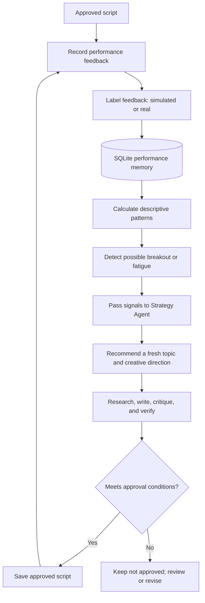

# NAZAR — Feedback and Learning Demonstration

## How previous feedback influences the next strategy output

> **Demo status:** This example is based on the previously shared memory-demo output. The feedback values are synthetic and demonstrate the learning workflow; they are not real NAZAR Instagram analytics. The exact full input records and complete raw Strategy Agent response were not preserved, so this document distinguishes recorded results from explanatory interpretation.

## 1. Objective

The feedback loop is intended to help the Multi-Agent Instagram Growth Brain use past content outcomes as one input to future strategy decisions.

It should:
- Store feedback against the relevant script/account.
- Keep simulated feedback distinguishable from real feedback.
- Calculate descriptive performance patterns.
- Detect possible breakout or fatigue signals.
- Provide those signals to the Strategy Agent.
- Encourage fresh topics and creative variation rather than copying a previous hit.
- Avoid treating observed performance as proof that a topic or format caused success.

## 2. Demo data and observed signal

The memory demo inserted four deterministic synthetic script/feedback examples, including topics related to oil, UPI, inflation, and tax/money.

The reported breakout comparison was:

| Measure | Demo result |
|---|---:|
| Breakout example topic | Tax / money-related topic |
| Breakout engagement | 35% |
| Baseline engagement | 15.8% |
| Breakout multiplier | 2.22× |
| Feedback type | Simulated |
| Real feedback available in this demo | No |

The breakout multiplier is the observed example engagement divided by the demo baseline, rounded to two decimal places. Both values are synthetic. They show that the breakout-detection logic can surface a relative signal from stored feedback; they do not establish actual audience behavior.

## 3. Before feedback: strategy decision

Without useful historical performance signals, the Strategy Agent must primarily rely on available channel intelligence, content requirements, research opportunities, and configured guardrails.

The project is designed to produce a structured recommendation containing fields such as:
- Topic
- Content bucket
- Hook style
- Format
- Tone
- Rationale
- Confidence
- Topics or formats to avoid

This section describes the intended baseline behavior. A separate “before” strategy output with identical inputs and the breakout signal disabled was not preserved for this demo, so a controlled before/after causal comparison is not claimed.

## 4. Feedback is stored in memory

The memory demo records script feedback in SQLite. The feedback interface supports metrics including:
- Views
- Reach
- Likes
- Shares
- Saves
- Comments
- Average watch time in seconds
- Followers gained

Feedback is labeled as simulated or real. The project memory layer can retrieve recent content and calculate performance patterns. Fatigue and breakout analytics consume eligible stored records and keep simulated and real patterns separate.

The memory database and feedback behavior are implemented in:
- `src/memory/database.py`
- `src/memory/performance_memory.py`
- `src/analytics/performance.py`
- `src/analytics/fatigue.py`

## 5. Breakout signal is detected

In the demo, the tax/money-related example was identified as a simulated breakout at approximately 2.22× the baseline engagement.

The Strategy Agent can use a breakout signal as contextual evidence that a content bucket or approach may be worth exploring. It should not treat the signal as a command to repeat the exact topic, hook, or script.

**Interpretation:** The demo shows a descriptive pattern in the synthetic data. It does not prove that the topic, hook, or format caused the higher engagement, nor that a future post will perform similarly.

## 6. After feedback: next strategy output

The previously shared Strategy Agent output following the memory demo was:

| Field | Reported recommendation |
|---|---|
| Topic | Why does India's electricity tariff system affect household bills? |
| Content bucket | Economy |
| Hook style | Conflict |
| Format | Animated Explainer Reel |
| Tone | Informative Hinglish |
| Confidence | 0.75 in the memory-demo summary |
| Strategy rationale | Considered a simulated Economy breakout signal while selecting a fresh topic and rotating hook/format choices |

A later saved-strategy reference recorded confidence as 0.78. Because the original complete output is not available here to resolve this difference, treat the confidence as **reported inconsistently (0.75 or 0.78)** and confirm it from the actual run artifact if exact reproducibility is required.

### What changed in the next output?

- **Topic selection:** The next recommendation explored electricity tariffs and household bills rather than repeating the tax/money breakout topic.
- **Bucket-level learning:** The system used the Economy signal as context for selecting another relevant Economy topic.
- **Creative variation:** The recommendation used a Conflict hook and Animated Explainer Reel format, rather than simply cloning a previous script.
- **Rationale:** The strategy output exposed why the recommendation was selected, making the use of memory inspectable.

The recorded demo supports that the strategy was generated with memory signals available. It does not isolate the breakout signal as the sole cause of the recommendation; the Strategy Agent also considers other context and constraints.

## 7. End-to-end feedback loop



## 8. How to reproduce the demo

Run these commands from the project root in the activated virtual environment:

```powershell
python -m scripts.demo_memory
```

To run the memory demo and request a Strategy Agent recommendation:

```powershell
python -m scripts.demo_memory --generate-strategy
```

The demo was previously reported to:
1. Insert four deterministic synthetic examples idempotently.
2. Print stored feedback and performance patterns.
3. Show fatigue and breakout analysis.
4. Report that the example breakout is simulated.
5. Optionally call the Strategy Agent to generate a next recommendation.

Run the demo against your current checkout and preserve its actual console output if you need a fully reproducible submission record.

## 9. Guardrails and responsible interpretation

| Guardrail | Why it matters |
|---|---|
| Simulated/real separation | Prevents synthetic demonstration data from being represented as live performance |
| Descriptive breakout signal | Avoids claiming causation from a relative metric |
| Fresh-topic selection | Learns from patterns without simply repeating a previous hit |
| Fatigue signal treated as advisory | Avoids banning a topic based on a small or noisy sample |
| Human review | Keeps editorial judgment in the loop |
| Separate approval gate | Prevents a performance signal from bypassing research, critique, and verification |

A breakout signal must never bypass research verification, script verification, numeric validation, critic scoring, or the configured approval threshold.

## 10. What this demo proves—and what it does not

### Demonstrated by the remembered run
- Synthetic feedback was stored and analyzed.
- The memory demo surfaced a 35% engagement example against a 15.8% baseline (about 2.22×).
- The Strategy Agent produced a fresh Economy recommendation for electricity tariffs.
- The system considered memory as a strategy signal and did not need to repeat the exact breakout topic.
- The demo identified the feedback as simulated, with no real feedback records reported.

### Not established by this demo
- That the same topic or creative choices will perform well on a real Instagram account.
- That memory alone caused the new recommendation.
- That the breakout is statistically significant.
- That actual audience fatigue or a true breakout has been established.
- That the resulting electricity-tariff script was approved or published.
- That live Instagram analytics are connected.

## 11. Reviewer takeaway

This demonstration illustrates the intended learning loop: **feedback → memory → descriptive pattern → strategy signal → fresh recommendation**.

The value is not that the system guarantees viral content. It is that prior outcomes can be retained, inspected, and used as one input to future planning, while simulated data, uncertainty, and approval requirements remain explicit.
